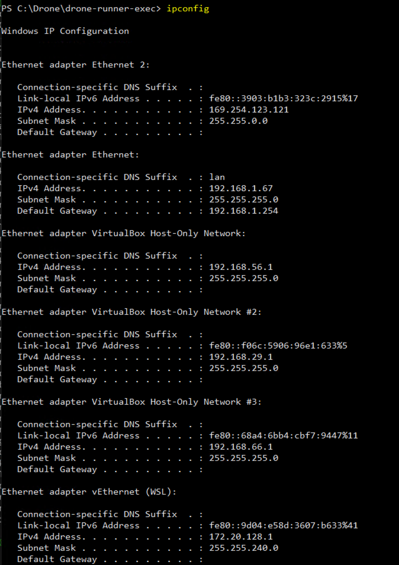
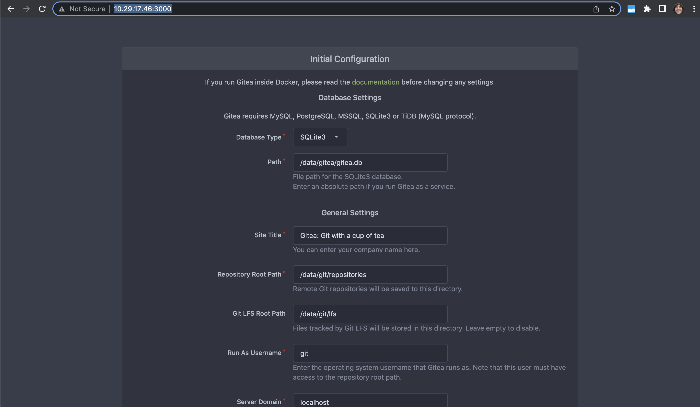

# Atelier Docker et CI/CD

## Rappels sur Docker

Docker est une plate-forme permettant de lancer des applications dans des _conteneurs_.

Selon 451 Research, cité par Wikipedia :

> Docker est un outil qui peut empaqueter une application et ses dépendances dans un conteneur isolé, qui pourra être exécuté sur n'importe quel serveur

Docker est un outil de _conteneurisation_, à ne pas confondre avec la _virtualisation_.

Les outils de virtualisation (VMWare, VirtualBox, etc.) :

* permettent de lancer des _machines virtuelles_, 
* lesquelles sont préalablement configurées (nombre de CPU, quantité de RAM, interfaces réseau...),
* et dans lesquelles on doit installer un OS (appelé "OS invité" par opposition à l'"OS hôte", celui de la machine qui exécute le logiciel de virtualisation).

Du fait qu'on lance un OS complet pour pouvoir lancer une application au-dessus, la virtualisation est gourmande en ressources.

Par opposition, la conteneurisation :

* ne repose pas sur des machines virtuelles "isolées" de la machine hôte,
* ni sur le lancement d'un OS complet,
* permet de lancer des applications dans des conteneurs,
* utilisant noyau de l'OS hôte,
* relativement isolés du reste du système hôte,
* n'ayant pas par défaut de limites matérielles (usage de RAM par ex.) autres que celles disponibles sur le système hôte.

La conteneurisation est, par comparaison à la virtualisation, économe en ressources.


> À noter : Docker n'est pas le seul système de conteneurisation. Il existe une certaine interopérabilité entre différents systèmes, via l'utilisation d'_images_ qui respectent un format standardisé.

### Cas d'utilisation et avantages

* En "packageant" une application et ses dépendances dans une "image" exécutable n'importe où, on s'affranchit de problèmes comme, par exemple, l'incompatibilité d'une application avec certaines bibliothèques (ou versions de ces bibliothèques) installées sur le système cible.
* De fait, on peut, dans une équipe de développeurs, créer, via Docker, un environnement de travail standardisé, que tout le monde va pouvoir récupérer et utiliser tel quel, quel que soit l'OS utilisé.
* Plus intéressant encore, Docker rend le déploiement d'applications beaucoup plus aisé. À partir du moment où Docker est installé sur un serveur, on pourra lancer des applications serveur web, des bases de données, etc. dans Docker, sans casse-têtes de configuration.

## Images et conteneurs

Parmi les concepts importants :

* **Image** : "paquet" contenant l'application et ses dépendances (bibliothèques / outils dont elle a besoin). Si on prend la métaphore du développement logiciel suivant le paradigme de la P.O.O., on pourrait comparer une image à une classe.
* **Conteneur** : processus démarré à partir de l'image, autrement dit, l'application en fonctionnement. Suivant la même comparaison, on pourrait comparer un conteneur à une instance d'une classe.

On peut lancer plusieurs conteneurs à partir d'une même image. Petit exemple pour illustrer, qui permettra au passage de (re)voir certaines commandes de base de Docker.

### Récupérer une image

Les applications "empaquetées" avec Docker sont le plus souvent stockées sur un _registre_ de conteneurs. Le plus connu est le [Docker Hub](https://hub.docker.com/), mais il en existe bien d'autres :

* GHCR (GitHub Container Registry),
* l'équivalent chez les concurrents de GitHub (GitLab, Atlassian),
* les registres fournis par les acteurs du cloud (AWS, Azure, GCP),
* voire des registres auto-hébergés, privés, accessibles au sein d'une organisation uniquement

Nous allons récupérer une image d'une application très simple, le "Hello World" de Docker, via la commande `docker pull` :

```
docker pull hello-world:latest
```

Ce qui produit l'affichage suivant :

```
latest: Pulling from library/hello-world
2db29710123e: Pull complete
Digest: sha256:13e367d31ae85359f42d637adf6da428f76d75dc9afeb3c21faea0d976f5c651
Status: Downloaded newer image for hello-world:latest
docker.io/library/hello-world:latest
```

Docker a constaté que l'image `hello-world`, avec le "tag" (~version) `latest`, n'était pas disponible localement, et l'a téléchargée.

### Lancer un conteneur

Une fois l'image téléchargée, on peut lancer un conteneur à partir de cette image, via `docker run` :

```
docker run hello-world:latest
```

Ce qui produit cet affichage :

```

Hello from Docker!
This message shows that your installation appears to be working correctly.

To generate this message, Docker took the following steps:
 1. The Docker client contacted the Docker daemon.
 2. The Docker daemon pulled the "hello-world" image from the Docker Hub.
    (amd64)
 3. The Docker daemon created a new container from that image which runs the
    executable that produces the output you are currently reading.
 4. The Docker daemon streamed that output to the Docker client, which sent it
    to your terminal.

To try something more ambitious, you can run an Ubuntu container with:
 $ docker run -it ubuntu bash

Share images, automate workflows, and more with a free Docker ID:
 https://hub.docker.com/

For more examples and ideas, visit:
 https://docs.docker.com/get-started/

```

> Notez que si on n'avait pas préalablement exécuté `docker pull`, Docker aurait téléchargé l'image de toute façon. Ce qui n'enlève pas l'utilité de cette commande, qui permet de récupérer la dernière version de l'image disponible, pour peu qu'une nouvelle version ait été publiée depuis le dernier `pull`.

### Lister les conteneurs

Essayez la commande `docker ps -a` (`docker ps` pour afficher les conteneurs Docker, `-a` pour inclure ceux qui ne sont pas/plus en fonctionnement). Résultat :

```
CONTAINER ID   IMAGE                 COMMAND       CREATED          STATUS                       PORTS      NAMES
37aefecd68e8   hello-world:latest    "/hello"      3 minutes ago    Exited (0) 4 minutes ago                boring_solomon
```

Si vous relancer la commande `docker run hello-world:latest` suivie de `docker ps -a`, vous verrez une deuxième ligne apparaître, montrant qu'on peut bien lancer plusieurs conteneurs à partir d'une même image.

### Supprimer conteneurs et images

Il est utile de faire le ménage dans les conteneurs qui ne servent plus (ici l'application Hello World a quitté immédiatement, ce qui n'est pas le cas d'autres applications comme des serveurs web).

On peut supprimer un conteneur avec `docker rm` suivi soit de l'ID (ou de quelques caractères de l'ID) ou du nom du conteneur. Ainsi, ces 3 commandes auront le même effet :

* `docker rm 37aefecd68e8`
* `docker rm 37a`
* `docker rm boring_solomon`

Quant une image ne nous sert plus, on peut la supprimer. Listez les images avec `docker image ls`. Résultat :

```
REPOSITORY          TAG            IMAGE ID       CREATED             SIZE
hello-world         latest         feb5d9fea6a5   9 months ago        13.3kB
```

Vous pouvez supprimer une image via la combinaison repository + tag ou via son ID :

* `docker rmi hello-world:latest`,
* ou `docker rmi feb5d9fea6a5`

Ici l'image `hello-world` est très légère, mais certaines images (par ex. GitLab) peuvent dépasser les 1Go voire plus.

## Conteneuriser une application

Récupérer des images "prêtes à l'emploi" du Docker Hub ou d'un autre registre est une chose. Mais comment "packager" ses propres applications dans des images Docker ?

Un exemple très simple avec Node.js. Créez un nouveau dossier, par ex. `node-hello-world`. Créez-y un fichier `index.js` contenant ce code (c'est l'exemple de la page [About](https://nodejs.org/en/about/) de Node.js, très légèrement adapté) :

```javascript
const http = require('http');

const hostname = '0.0.0.0';
const port = 3000;

const server = http.createServer((req, res) => {
  res.statusCode = 200;
  res.setHeader('Content-Type', 'text/plain');
  res.end('Hello World');
});

server.listen(port, hostname, () => {
  console.log(`Server running at http://${hostname}:${port}/`);
});
```

Puis créez un deuxième fichier nommé `Dockerfile` (attention à la casse et &rarr; `D` en début de fichier), contenant :

```
FROM node:16-alpine

WORKDIR /app

COPY index.js .

CMD node index
```

C'est le `Dockerfile` qui va permettre de **construire** ou "builder" une image, à partir d'une suite d'"instructions". Le Dockerfile ci-dessus est, à peu de choses près, le plus simple qui soit.

* Un Dockerfile commence toujours par `FROM` suivi du nom d'une **image de base**. Si on "package" une application Node.js, on va utiliser une image contenant déjà Node.js (ainsi que les packages managers `npm` et `yarn`). Ici `node` avec le tag `16-alpine` (version 16 de Node, installée sur une base Linux Alpine, distribution Linux très légère)
* Une bonne pratique est d'indiquer le "dossier de travail", autrement dit le _dossier depuis lequel l'application va être lancée, dans le conteneur_. On le définit via `WORKDIR` suivi du nom du dossier (qui sera créé s'il n'existe pas).
* On va ensuite *copier dans l'image* les fichiers dont on a besoin pour lancer notre application (et éventuellement, pour la compiler au préalable, dans le cas de langages comme Java, C#, TypeScript...). Ceci via la commande `COPY`. Ici la source est notre `index.js`, et la destination, `.`, signifiant habituellement le "dossier courant", se réfère ici au workdir.
* Enfin, le Dockerfile se termine par `CMD` : la commande/application qui doit être exécutée dans le conteneur. *Un* conteneur exécute habituellement *une* application.

Une fois le Dockerfile écrit, on va le "builder" pour aboutir à une image, laquelle sera nommée (`node-hello-world`) et "taggée"/versionnée (`latest`). Notez qu'on termine la commander `docker build` par le dossier courant `.` (cette fois ci au sens de dossier où on se trouve dans notre terminal) : c'est l'emplacement où Docker va chercher le `Dockerfile` à builder.

```
docker build -t node-hello-world:latest .
```

Résultat :

```
[+] Building 0.2s (8/8) FINISHED
 => [internal] load build definition from Dockerfile                                                               0.0s
 => => transferring dockerfile: 104B                                                                               0.0s
 => [internal] load .dockerignore                                                                                  0.0s
 => => transferring context: 2B                                                                                    0.0s
 => [internal] load metadata for docker.io/library/node:16-alpine                                                  0.0s
 => [1/3] FROM docker.io/library/node:16-alpine                                                                    0.0s
 => [internal] load build context                                                                                  0.0s
 => => transferring context: 373B                                                                                  0.0s
 => CACHED [2/3] WORKDIR /app                                                                                      0.0s
 => [3/3] COPY index.js .                                                                                          0.0s
 => exporting to image                                                                                             0.0s
 => => exporting layers                                                                                            0.0s
 => => writing image sha256:f71aa4dd43a1b967c96bbc88dcd8a9567a57ab5ddc597cabd418036180cceccc                       0.0s
 => => naming to docker.io/library/node-hello-world:latest                                                         0.0s

Use 'docker scan' to run Snyk tests against images to find vulnerabilities and learn how to fix them
```

On peut enfin lancer un conteneur à partir de cette image :

```
docker run -p 8000:3000 -d node-hello-world:latest
```

Notez les paramètres :

* `-p 8000:3000` : côté réseau, le conteneur est relativement isolé du système hôte. L'app, écoutant sur le port 3000 dans le conteneur, sera inaccessible si on ne "publie" rend pas ce port accessible depuis l'extérieur du conteneur. Ici, on rend le port 3000 du conteneur accessible via le port 8000 du système hôte. Si vous ouvrez votre navigateur sur <http://localhost:8000>, vous verrez apparaître le message "Hello World".
* `-d` pour "daemonize" permet de lancer l'app en arrière-plan, afin de ne pas "bloquer" le terminal.

Du fait de l'utilisation de `-d`, les éventuels messages imprimés sur la "sortie standard" du système n'apparaissent plus, contrairement à ce qui s'est passé lors de l'exécution du `hello-world` de Docker. Pour visualiser les messages émis par l'application, on peut se servir de `docker logs` suivi de l'ID ou du nom du conteneur.

On retrouve d'abord l'ID ou le nom via `docker ps`. Ici l'ID du conteneur étant `ae3732c8c92b`, puis on peut lancer `docker logs ae37` pour voir s'afficher :

```
Server running at http://0.0.0.0:3000/
```

## CI/CD

Si Docker est en soi un outil précieux pour les développeurs, il fait le plus souvent partie d'une panoplie d'outils.

Dans la démarche DevOps, on retrouve souvent les acronymes CI et CD.

### Brèves définitions et explications

[plus de détails](https://www.redhat.com/fr/topics/devops/what-is-ci-cd).

#### CI = _Continuous Integration_ = Intégration Continue.

Cela désigne un processus d'automatisation pour les développeurs.

Concrètement, il s'agit de faire en sorte que notre (nos) application(s) soi(en)t toujours dans un état livrable.

Dès qu'un(e) développeur(se) pousse ses modifications sur un dépôt Git, on va, par exemple :

* _linter_ le code (vérifier les erreurs et le respect des conventions de codage)
* éventuellement lancer une analyse du code, via des outils tels que SonarQube - permettant de détecter des mauvaises pratiques (duplication de code), des vulnérabilités (par ex. aux injections SQL)
* lancer des suites de tests automatisés

On peut conditionner le merge de Pull Requests au passage avec succès de ces différentes vérifications.

#### CD = _Continuous Delivery_ ou _Continuous Deployment_

Traduits par livraison continue ou déploiement continu, termes relativement interchangeables.

* Livraison continue. Par ex. : re-build des images Docker, une fois la phase CI passée.
* Déploiement continu. Par ex. : une fois les images Docker re-buildées, les récupérer automatiquement depuis le serveur de production, et relancer les conteneurs à partir des images mises à jour.

### Outils

D'innombrables outils de CI/CD sont disponibles, et l'offre s'est considérablement accrue ces dernières années.

On peut citer :

* Jenkins, vénérable ancêtre, Open Source, très extensible, relativement complexe à configurer, et à l'interface... désuète (pour rester poli)
* Travis CI,
* GitLab,
* GitHub Actions,
* TeamCity (JetBrains),
* etc.

GitLab et GitHub offrent des solutions très intégrées puisqu'ils offrent à la fois des dépôts de code source, des registres d'images Docker, et la possibilité de mettre en oeuvre tout le cycle d'intégration/livraision/déploiement continus.

Nous allons utiliser Drone CI, outil moins connu, mais qui présente l'avantage d'être très léger, et déployable sur une machine locale.

Nous allons également utiliser Gitea, clone Open Source de GitHub.

Les schémas d'ensemble qui suivent peuvent aider à comprendre leurs rôles respectifs dans le cycle CI/CD.

Dans ce 1er schéma, le "G" en 2 représente Gogs, outil qui a précédé Gitea. En 3-4 on trouve Drone CI.


Ce 2ème schéma est plus complet et montre que Drone n'est pas une application "monolithique", mais est composée de plusieurs "briques" :


### Mise en place de Gitea et Drone CI

Nous allons utiliser Docker pour déployer Gitea et Drone CI sur une machine locale.

Gitea est déployable via l'image Docker `gitea`. Drone, quant à lui, est composé d'un _serveur_ et d'au moins un _runner_ (nous en utiliserons deux).

Nous utiliserons également l'image Docker `registry`, ce qui nous permettra de disposer d'un registre d'images privé.

Nous aurions pu utiliser le Docker Hub. Mais cela présuppose d'avoir un compte et de s'authentifier pour pouvoir pousser des images. Or, il s'avère que ce n'est pas si simple qu'il n'y paraît de le faire avec Drone. Le registre privé fonctionnera localement et sans authentification (ce qui économisera au passage de la bande passante).

Nous pourrions lancer ces différents composants via de multiples invocations de `docker run`. Mais d'une part, chaque conteneur doit être lancé avec un certain nombre de paramètres pour fonctionner correctement : ce qui nous amènerait à saisir (ou copier/coller) de très longues lignes de commande dans le terminal. D'autre part, il serait plus pratique de lancer tous ces conteneurs simultanément.

Nous allons donc utiliser Docker Compose, "orchestrateur", qui permet de coordonner le lancement de plusieurs conteneurs, et également de configurer simplement un "réseau interne" à Docker leur permettant de communiquer entre eux.

Docker Compose fonctionne avec un (ou plusieurs) fichier(s) de configuration au format YAML. Nous en utiliserons un seul, avec le nom standard `docker-compose.yml`. 

#### Récupération du dépôt, modification du script de démarrage

Vous allez pouvoir cloner ce dépôt : <https://github.com/bhubr/drone-gitea-windows> (https://github.com/bhubr/drone-gitea-windows) (largement basé sur un [Gist](https://gist.github.com/ruanbekker/3847bbf1b961efc568b93ccbf5c6f9f6) de Ruan Bekker, spécialiste DevOps).

Il contient deux fichiers :

* le `docker-compose.yml`
* un script Bash permettant de lancer Docker Compose, en positionnant au préalable des variables d'environnement nécessaires au bon fonctionnement de l'ensemble.

> ⚠️ **Important** : installez [Git Bash](https://gitforwindows.org/) si vous ne l'avez pas déjà.

Il va falloir procéder en plusieurs étapes...

Avant de commencer, il va vous falloir récupérer votre adresse IP sur le réseau local. Notamment parce que, du fait du setup utilisé, nous ne pourrons pas utiliser simplement `localhost` ou `127.0.0.1`. Votre adresse IP doit ressembler à `10.29.17.46`.

Sous Windows, pour la retrouver, lancez un terminal puis saisissez `ipconfig`. Dans cette capture, l'adresse (192.168.1.67) est celle d'un PC connecté en filaire sur réseau domestique. Cherchez celle dans la liste qui commence par `10.29`.



**Ouvrez** le fichier `deploy.sh` avec votre IDE et à la ligne `IP_ADDRESS`, remplacez `192.168.1.67` par votre propre IP. Vous pouvez (mais ça ne changera, à vrai dire, rien) remplacer le "username" pour Drone, `rbekker87`, par un pseudo qui vous convient.

#### Lancement initial de Docker Compose

Lancez Docker Compose avec `bash deploy.sh` (qui appelle `docker-compose up`).

Vous allez ensuite procéder à la _vérification_ du bon fonctionnement de Gitea, et à la _finalisation_ de son installation.

:warning: Ici il faut procéder avec précaution ! :warning:.

Ouvrez dans votre navigateur <http://10.29.x.y:3000>, en adaptant à votre adresse IP spécifique. Vous arriverez sur la page d'installation de Gitea.



Il n'y a rien à changer. Scrollez jusqu'en bas et cliquez tout simplement "Install Gitea".

Vous allez avoir un écran indiquant que la connexion à Gitea ne marche plus, mais si vous rafraîchissez la page après 2-3 secondes, vous arriverez sur l'écran d'accueil de Gitea (qui aura installé, entretemps, sa base de données, et crée ses fichiers de config).

Créez un premier utilisateur en _notant bien le username et mot de passe_ (faites simple !).

#### 